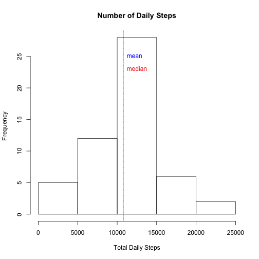
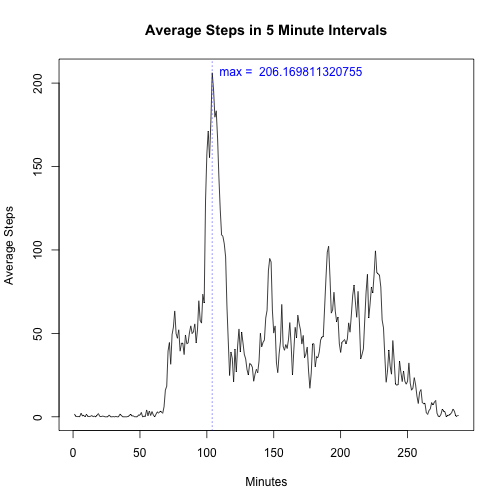
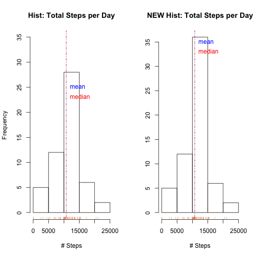
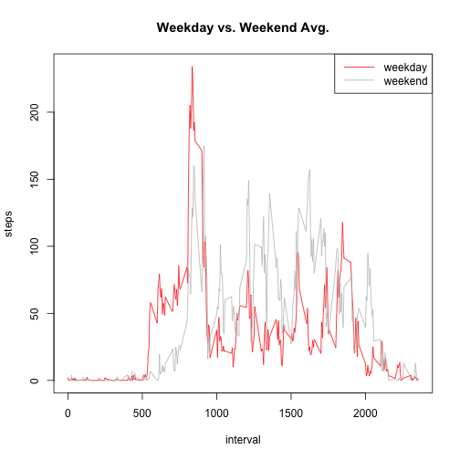

1. Loading and Processing the Data


```r
# Set Working Directory
setwd("~/Documents/Yvonne Low/Data Science Course/04 Reproducible Research")
# Read CSV into R
MyData <- read.csv(file="activity.csv", header=TRUE, sep=",")
# create new dataset without missing data 
newdata <- na.omit(MyData)
```

2. What is mean total number of steps taken per day?

```r
dailydata<-split(newdata,newdata$date, drop=TRUE) 
dailysteps<-sapply(dailydata,function(x) sum(x$steps))

#create histogram for total daily steps
hist(dailysteps, main = "Number of Daily Steps", xlab = "Total Daily Steps")
mean(dailysteps)
```

```
## [1] 10766.19
```

```r
median(dailysteps)
```

```
## [1] 10765
```

```r
# insert and label the mean
abline(v=mean(dailysteps), col="blue")             
text(mean(dailysteps),25,labels="mean", pos=4, col="blue")  

# insert and label the median
abline(v=median(dailysteps), lty=4, col="red")                    
text(mean(dailysteps),23,labels="median", pos=4, col="red") 
```

 

3. What is the average daily activity pattern?

```r
intervaldata<-split(newdata,newdata$interval, drop=TRUE)
intervalsteps<-sapply(intervaldata,function(x) mean(x$steps))
plot(intervalsteps, type="l", main ="Average Steps in 5 Minute Intervals", xlab="Minutes", ylab="Average Steps")

# insert and label the max
abline(v=which.max(intervalsteps), lty=3, col="blue")                  
text(which.max(intervalsteps),max(intervalsteps),  
     labels=paste("max = ",as.character((max(intervalsteps)))), 
     pos=4, col="blue")
```

 

```r
names(which.max(intervalsteps))
```

```
## [1] "835"
```

4. Impute missing values

```r
#calculate the number of missing
originalValue <- complete.cases(MyData)  
nMissing <- length(originalValue[originalValue==FALSE])                       
nComplete <- length(originalValue[originalValue==TRUE])                      
nMissing
```

```
## [1] 2304
```

```r
nComplete     
```

```
## [1] 15264
```

```r
set1 <- cbind(MyData,originalValue)                          # newData, with 'originalValue' column  
splitByOrig<-split(set1,set1$originalValue, drop=TRUE)  # split newData by whether originalValue exists

# For each row in the split data frame where originalValue == FALSE, 
# replace NA with the intervalAvg (rounded to the nearest integer)
# the impute value is found with a lookup from the intervalAvg named vector created earlier

for (row in 1:nrow(splitByOrig[["FALSE"]])){  
  splitByOrig[["FALSE"]][row,1] <- round(subset(intervalsteps,names(intervalsteps) ==
                                                  as.character(splitByOrig[["FALSE"]][row,3])))
}

set2 <- rbind(splitByOrig[["FALSE"]],splitByOrig[["TRUE"]])           # combine the TRUE & FALSE data frames  
set2 <- set2[with(set2, order(date, interval)), ]               # re-order by date & interval

summary(MyData)
```

```
##      steps                date          interval     
##  Min.   :  0.00   2012-10-01:  288   Min.   :   0.0  
##  1st Qu.:  0.00   2012-10-02:  288   1st Qu.: 588.8  
##  Median :  0.00   2012-10-03:  288   Median :1177.5  
##  Mean   : 37.38   2012-10-04:  288   Mean   :1177.5  
##  3rd Qu.: 12.00   2012-10-05:  288   3rd Qu.:1766.2  
##  Max.   :806.00   2012-10-06:  288   Max.   :2355.0  
##  NA's   :2304     (Other)   :15840
```

```r
summary(set2)
```

```
##      steps                date          interval      originalValue  
##  Min.   :  0.00   2012-10-01:  288   Min.   :   0.0   Mode :logical  
##  1st Qu.:  0.00   2012-10-02:  288   1st Qu.: 588.8   FALSE:2304     
##  Median :  0.00   2012-10-03:  288   Median :1177.5   TRUE :15264    
##  Mean   : 37.38   2012-10-04:  288   Mean   :1177.5   NA's :0        
##  3rd Qu.: 27.00   2012-10-05:  288   3rd Qu.:1766.2                  
##  Max.   :806.00   2012-10-06:  288   Max.   :2355.0                  
##                   (Other)   :15840
```

```r
# split Set2 by date
splitNewByDay <- split(set2,set2$date, drop=TRUE)
dailyStepsNew <- sapply(splitNewByDay, function(x) sum(x$steps))         # numeric vector w/ daily sum of steps  
hist(dailyStepsNew, main="NEW Hist: Total Steps per Day", xlab="         # Steps") # plot a histogram  
abline(v=mean(dailyStepsNew), lty=3, col="blue")                            # draw a blue line thru the mean  
abline(v=median(dailyStepsNew), lty=4, col="red")                           # draw a red line thru the median  
text(mean(dailyStepsNew),35,labels="mean", pos=4, col="blue")               # label the mean  
text(mean(dailyStepsNew),33,labels="median", pos=4, col="red")              # label the median  
```

 

```r
#plot the two histogram side by side
par(mfrow=c(1,2))

### plot the original histogram
hist(dailysteps, main="Hist: Total Steps per Day", xlab="# Steps", ylim=c(0,35)) # plot a histogram  
abline(v=mean(dailysteps), lty=3, col="blue")                      # draw a blue line thru the mean  
abline(v=median(dailysteps), lty=4, col="red")                     # draw a red line thru the median  
text(mean(dailysteps),25,labels="mean", pos=4, col="blue")         # label the mean  
text(mean(dailysteps),23,labels="median", pos=4, col="red")        # label the median  
rug(dailysteps, col="chocolate")

### plot the imputed histogram
hist(dailyStepsNew, main="NEW Hist: Total Steps per Day", xlab="# Steps", ylab="") # plot a histogram  
abline(v=mean(dailyStepsNew), lty=3, col="blue")                      # draw a blue line thru the mean  
abline(v=median(dailyStepsNew), lty=4, col="red")                     # draw a red line thru the median  
text(mean(dailyStepsNew),35,labels="mean", pos=4, col="blue")         # label the mean  
text(mean(dailyStepsNew),33,labels="median", pos=4, col="red")        # label the median  
rug(dailyStepsNew,col="chocolate")
```

 


5. Are there differences in activity patterns between weekdays and weekends?

```r
# weekends vs weekdays
MyData$date <- as.Date(strptime(MyData$date, format="%Y-%m-%d")) # convert date to a date() class variable  
MyData$day <- weekdays(MyData$date)                              # build a 'day' factor to hold weekday / weekend  
for (i in 1:nrow(MyData)) {                                       # for each day  
  if (MyData[i,]$day %in% c("Saturday","Sunday")) {             # if Saturday or Sunday,
    MyData[i,]$day<-"weekend"                                 #   then 'weekend'
  }
  else{
    MyData[i,]$day<-"weekday"                                 #    else 'weekday'
  }
}

## aggregate newData by steps as a function of interval + day  
stepsByDay <- aggregate(MyData$steps ~ MyData$interval + MyData$day, MyData, mean)

## reset the column names to be pretty & clean
names(stepsByDay) <- c("interval", "day", "steps")

## plot weekday over weekend time series
par(mfrow=c(1,1))  
with(stepsByDay, plot(steps ~ interval, type="n", main="Weekday vs. Weekend Avg."))  
with(stepsByDay[stepsByDay$day == "weekday",], lines(steps ~ interval, type="l", col="red"))  
with(stepsByDay[stepsByDay$day == "weekend",], lines(steps ~ interval, type="l", col="16" ))  
legend("topright", lty=c(1,1), col = c("red", "16"), legend = c("weekday", "weekend"), seg.len=3)
```

 

